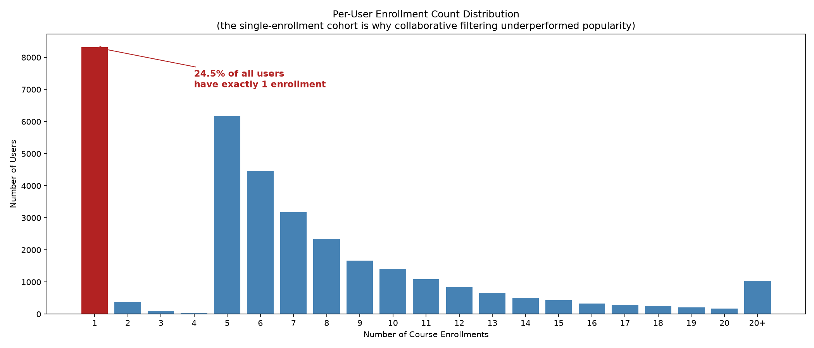

# Course Recommender: A Comparative Study of Nine Recommendation Approaches

An end-to-end recommender-system project that implements, evaluates, and deploys **nine recommendation
approaches** on an online-course enrollment dataset — and finds that most of them lose to a trivial
popularity baseline.

**[▶ Live demo](REPLACE_WITH_STREAMLIT_LINK)** · built from the IBM/Coursera Machine Learning Capstone,
then re-engineered into a reproducible, tested, deployable system.

> The demo may take a few seconds to wake on first load — it runs on Streamlit Community Cloud's free tier,
> which sleeps idle apps.

---

## The headline result

All nine models were evaluated on a held-out ranking task (Precision@10 on a 5-core user subset). The
result is the interesting part:

| Rank | Model | Precision@10 | Beats popularity? |
|-----:|-------|-------------:|:-----------------:|
| 1 | **content_clustering** | 0.1082 | ✅ |
| 2 | *popularity_baseline* | 0.0964 | — (baseline) |
| 3 | content_user_profile | 0.0310 | ❌ |
| 4 | content_course_similarity | 0.0244 | ❌ |
| 5 | cf_nmf | 0.0097 | ❌ |
| 6 | cf_classification | 0.0088 | ❌ |
| 7 | cf_ann | 0.0073 | ❌ |
| 8 | cf_regression | 0.0017 | ❌ |
| 9 | cf_knn | 0.0006 | ❌ |

**Only one of eight trained models beats "just recommend the most popular courses."** All five
collaborative-filtering models — including a neural embedding model — rank *below* the popularity
baseline. This isn't a bug; it's what the data supports, and the rest of this README explains why.

---

## Why: the data has almost no collaborative signal



**24.5% of users have exactly one enrollment**, and enrollments are heavily concentrated — 63% of all
233,306 enrollments go to just 20 courses. A dataset this sparse and this concentrated gives
collaborative filtering very little to learn from: most users simply don't have enough interaction
history to model. The winning model, `content_clustering`, works precisely because it *sidesteps* this —
it's popularity ranking with a light genre-based personalization layer, robust exactly where rating-based
CF is fragile.

**The takeaway:** on sparse, popularity-concentrated data, light personalization on top of popularity
beats heavy collaborative filtering. Choosing the right *baseline* and the right *metric* matters more
than model sophistication.

---

## Metric choice is itself a modeling decision

The collaborative-filtering models were first evaluated by RMSE (rating-prediction error), as the source
notebooks intended. Under RMSE, `cf_regression` looked like the *best* CF model (0.81, near the
mean-baseline). Under held-out **ranking**, it's nearly the *worst* (Precision@10 = 0.0017).

The reason: `cf_regression` learned to predict ≈4.0 for everything — low error, zero ability to rank.
Ranking models by RMSE would have selected one of the least useful recommenders. This project uses
ranking metrics (Precision@k, Recall@k, catalog coverage) throughout, because they measure the task that
actually matters.

---

## The nine models

| Family | Model | Approach |
|--------|-------|----------|
| Content-based | `content_course_similarity` | BoW → cosine similarity between courses |
| Content-based | `content_user_profile` | User genre-profile × course genres |
| Content-based | `content_clustering` | KMeans on user profiles + within-cluster popularity |
| Collaborative | `cf_knn` | Item-based KNN (Surprise) |
| Collaborative | `cf_nmf` | Non-negative matrix factorization (Surprise) |
| Collaborative | `cf_ann` | Neural embedding model (Keras RecommenderNet) |
| Collaborative | `cf_classification` | Classifier on learned embeddings → expected rating |
| Collaborative | `cf_regression` | Regressor on learned embeddings → predicted rating |
| Baseline | `popularity_baseline` | Global most-enrolled courses |

---

## Engineering notes (what makes this more than the tutorial)

This started as the IBM capstone but was rebuilt to hold up as a system:

- **Produced its own artifacts.** Rather than loading the course starter's precomputed similarity matrices,
  embeddings, and profiles, every artifact is generated from scratch by the pipeline. The from-scratch
  BoW→similarity pipeline reproduces the reference value `0.6626221399549089` exactly.
- **One interface for every model.** All nine implement a common `Recommender` API
  (`fit(train_df)` / `recommend(user, k, exclude)`), so they're directly comparable and interchangeable in
  both evaluation and the app.
- **Caller-controlled masking — the key design decision.** The `exclude` set is supplied by the caller,
  not baked into the model. Evaluation passes each user's *train-only* enrollments (so held-out test
  courses stay recommendable); the app passes *full* history. One interface, two contexts, no contradiction.
- **A rigorous, reproducible evaluation.** A single seeded, persisted per-user holdout (`data/splits/`);
  a 5-core filter for meaningful evaluation; and a two-tier comparison (a common 124-course /
  common-user table for fair ranking, plus a native-universe table for reach).
- **An honest baseline.** The popularity baseline is a first-class model in the comparison — which is how
  we know most trained models don't beat it.
- **Tested.** A pytest suite (63 tests, 9 models × 7 properties) locks the interface contract — including
  that `recommend()` always respects `exclude`, the property the evaluation's correctness depends on. It
  caught a real reproducibility bug (TensorFlow seeding across independently-constructed models).

---

## Reproducing the results

```bash
# 1. Environment (Python 3.11; gensim/TF need it)
python -m venv .venv && source .venv/bin/activate
pip install -r requirements-precompute.txt

# 2. Build the canonical split, fit all models, run the evaluation
python -m src.evaluation          # writes results/comparison_common.csv, comparison_native.csv

# 3. (Optional) regenerate the app's recommendation tables
python scripts/precompute_app_recommendations.py

# 4. Tests
pytest

# 5. Run the app locally
pip install -r requirements.txt   # light: pandas + streamlit only
streamlit run app.py
```

The evaluation is deterministic (seeded `rs=123`); `results/*.csv` regenerate identically from the code
and canonical split.

---

## Repository layout

```
src/
  data.py                 # data loading + canonical train/test split
  models/
    base.py               # Recommender interface (fit / recommend)
    <nine model files>    # one per approach
  evaluation.py           # held-out ranking evaluation, two-tier comparison
scripts/
  precompute_app_recommendations.py   # fits models, writes app parquet tables
tests/                    # pytest suite (interface contract + regression tests)
notebooks/                # the 11 completed capstone notebooks (analysis + EDA)
data/                     # ratings, genres, splits, precomputed app tables
results/                  # comparison_common.csv, comparison_native.csv
figures/                  # EDA charts
app.py                    # Streamlit demo (light: pandas + streamlit only)
requirements.txt          # app runtime deps (deploy)
requirements-precompute.txt  # heavy deps for training/eval (TF, Surprise, sklearn, gensim)
```

---

## Architecture & the demo-vs-production line

The deployed app is a **demo**, and its architecture reflects that deliberately: recommendations are
**precomputed** into static parquet tables, and the Streamlit app only *reads* them (imports are limited
to `pandas` and `streamlit`). This keeps the deployed app light enough for a free-tier host — no
TensorFlow or model-fitting at request time.

**A production version** would look different: serve recommendations from a database (e.g. Neon
serverless Postgres, which I use on another project) behind an API, with the precompute pipeline writing
to the DB on a schedule and the app querying by user. That separation — a heavy offline training pipeline
feeding a light online serving layer — is the same shape as here, just with a database instead of files.

---

## Dataset

Online-course enrollment data from the IBM/Coursera Machine Learning Capstone: 233,306 enrollments across
33,901 users and 126 rated courses (307 in the full content catalog), with a 14-genre course taxonomy.

## Acknowledgements

Model designs and dataset are from IBM's Machine Learning Capstone (Coursera). This repository is an
independent re-engineering of that coursework into a reproducible, evaluated, and deployed system — the
modeling approaches are IBM's; the pipeline architecture, evaluation methodology, testing, and deployment
are my own.
